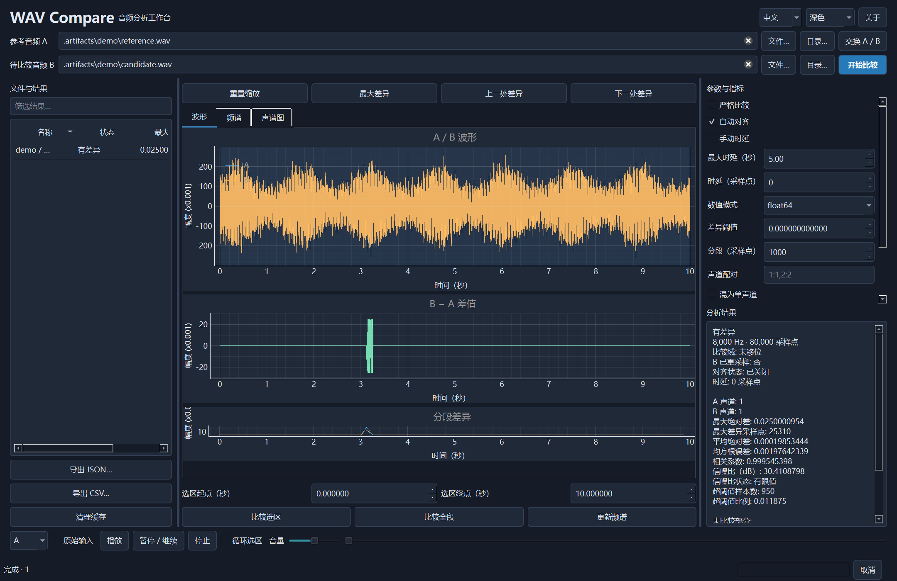

# WAV Compare

[](https://github.com/sunging/wav_compare/actions/workflows/checks.yml)
[中文说明](README.zh-CN.md) · [Comparison semantics](docs/comparison.md) · [Releasing](docs/releasing.md)

A desktop workbench and headless CLI for comparing WAV audio, from **8 kHz** speech to high-rate multichannel recordings. Built with PySide6, pyqtgraph, NumPy, SoundFile, SciPy and SoXR.



## Install

Install [uv](https://docs.astral.sh/uv/getting-started/installation/), then:

```sh
uv tool install --python 3.12 git+https://github.com/sunging/wav_compare.git
wav-compare
```

Python 3.11 or newer is required. uv can download Python automatically. If the command is not on your PATH, run `uv tool update-shell` and reopen your terminal. The first formal release is **0.1.0**, prepared in an open release PR. Until that PR is merged, main reports the unreleased bootstrap version **0.0.0**.

After a version has actually been released, append its tag to the Git URL, e.g. `git+https://github.com/sunging/wav_compare.git@v0.1.0`. No PyPI publication or standalone installer is required.

Windows, macOS and Linux are covered by CI. Linux needs a graphical session and Qt system libraries (Debian/Ubuntu: `libegl1 libopengl0 libxkbcommon0`, plus your desktop's Qt/XCB dependencies). Playback needs a working audio device. CLI comparison never opens a window or audio device.

## Workbench

- Open or drop two files or folders. Recursive folder matching uses case-insensitive relative paths and reports missing files and collisions.
- Inspect A/B waveforms, B − A differences, segment statistics, Welch spectra and STFT spectrograms.
- Default preprocessing resamples **B to A's rate**, then estimates one fixed delay. Every transformation is reported. Strict mode disables both.
- Compare all channels by index, enter explicit **1-based** pairs (`1:1,2:2`), or deliberately mix each input to mono.
- Select a region, find the largest difference, step through differing regions, and listen to A, B or their difference. Playback volume never changes metrics.
- Switch English/Chinese and system/light/dark themes. Paths, options and layout are saved locally.
- Export versioned JSON or CSV. Single-file export reflects the current selection analysis; directory export contains the complete batch.

Keyboard: **Ctrl+Enter** compare, **Esc** cancel, **Ctrl+0** reset zoom, **Space** pause/resume. The seek bar restarts playback at a position inside the selection. Original-input playback uses each source's original seconds; processed playback follows the aligned timeline.

## Command line

```sh
wav-compare gui reference.wav candidate.wav
wav-compare compare reference.wav candidate.wav --json report.json --csv report.csv
wav-compare compare before/ after/ --strict --threshold 0.0001 --json batch.json
wav-compare compare a.wav b.wav --channels 1:2,2:1 --no-align
wav-compare compare a.wav b.wav --offset 160 --region 2 8
wav-compare --version
```

JSON goes to stdout, errors to stderr. Positive `--offset` means B is delayed, measured in A-rate samples. `--region START END` selects seconds on the aligned overlap timeline. Numeric modes are `float64` (default normalized samples), `float32`, `pcm16`, `pcm24`, `pcm32`; thresholds use the chosen mode's units. See `wav-compare compare --help`.

Exit codes: **0** within threshold without missing channels/tails; **1** differences or missing files; **2** invalid input, collision, empty batch or processing errors; **130** cancellation. Batch failures do not discard successful rows.

## Performance and development

Block reads, streaming resampling, multilevel waveform envelopes and disk-backed statistics avoid retaining full recordings in RAM. The GUI uses at most two workers and a 256 MiB viewport cache. Selecting a directory result does not rerun the batch. See [measured performance](docs/performance.md).

```sh
git clone https://github.com/sunging/wav_compare.git
cd wav_compare
uv sync --locked
uv run wav-compare
uv run ruff check .
uv run pytest -q
uv build
uv run python tools/check_version.py
```

Tests synthesize their own audio. The package separates `audio`, `engine`, `batch`, `views`, `reports`, `cli` and `ui`. Core/CLI imports do not initialize Qt. `tools/benchmark.py` writes ignored synthetic data to `.artifacts`; the default workload needs about 6 GiB of disk. Resampling B adds roughly `frames × channels × 8` bytes of disk cache.

## Versions and provenance

Conventional Commits feed release-please, which maintains the version and [CHANGELOG](CHANGELOG.md) in a release PR. Merging that PR is the release decision; ordinary pushes do not automatically merge it. See [release maintenance](docs/releasing.md).

Based on [sunging/py_script's wav_compare_qt.py](https://github.com/sunging/py_script/blob/1780b081541e424d73ae2b0e24edebfc7f7ab4af/wav_compare_qt.py), commit `1780b081541e424d73ae2b0e24edebfc7f7ab4af`. The independent implementation fixes integer overflow, first-channel-only comparisons, inconsistent sample-rate handling and synchronous directory recomputation. [MIT](LICENSE), with the source owner's authorization. Dependencies retain their respective licenses.
